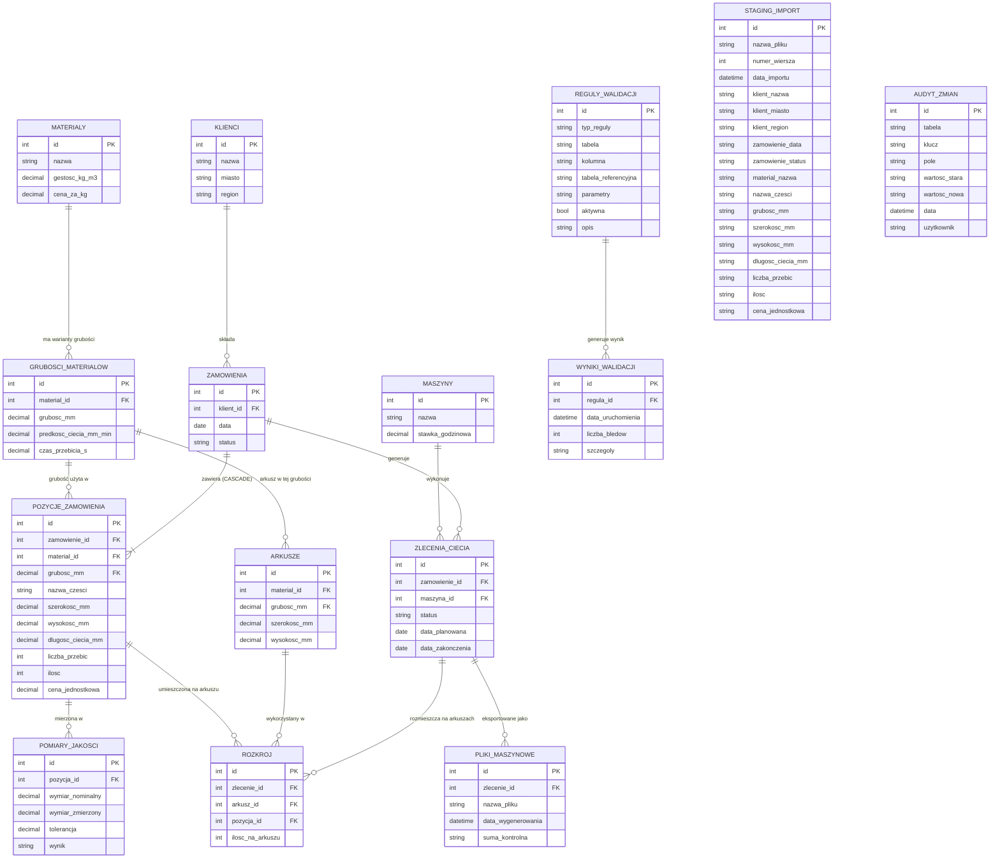

# NestBase — ERD (diagram związków encji)

## Diagram

```mermaid
erDiagram
    KLIENCI ||--o{ ZAMOWIENIA : "składa"
    ZAMOWIENIA ||--|{ POZYCJE_ZAMOWIENIA : "zawiera (CASCADE)"
    MATERIALY ||--o{ GRUBOSCI_MATERIALOW : "ma warianty grubości"
    GRUBOSCI_MATERIALOW ||--o{ POZYCJE_ZAMOWIENIA : "grubość użyta w"
    GRUBOSCI_MATERIALOW ||--o{ ARKUSZE : "arkusz w tej grubości"
    ZAMOWIENIA ||--o{ ZLECENIA_CIECIA : "generuje"
    MASZYNY ||--o{ ZLECENIA_CIECIA : "wykonuje"
    ZLECENIA_CIECIA ||--o{ ROZKROJ : "rozmieszcza na arkuszach"
    ARKUSZE ||--o{ ROZKROJ : "wykorzystany w"
    POZYCJE_ZAMOWIENIA ||--o{ ROZKROJ : "umieszczona na arkuszu"
    POZYCJE_ZAMOWIENIA ||--o{ POMIARY_JAKOSCI : "mierzona w"
    REGULY_WALIDACJI ||--o{ WYNIKI_WALIDACJI : "generuje wynik"
    ZLECENIA_CIECIA ||--o{ PLIKI_MASZYNOWE : "eksportowane jako"

    KLIENCI {
        int id PK
        string nazwa
        string miasto
        string region
    }

    MATERIALY {
        int id PK
        string nazwa
        decimal gestosc_kg_m3
        decimal cena_za_kg
    }

    GRUBOSCI_MATERIALOW {
        int id PK
        int material_id FK
        decimal grubosc_mm
        decimal predkosc_ciecia_mm_min
        decimal czas_przebicia_s
    }

    MASZYNY {
        int id PK
        string nazwa
        decimal stawka_godzinowa
    }

    ZAMOWIENIA {
        int id PK
        int klient_id FK
        date data
        string status
    }

    POZYCJE_ZAMOWIENIA {
        int id PK
        int zamowienie_id FK
        int material_id FK
        decimal grubosc_mm FK
        string nazwa_czesci
        decimal szerokosc_mm
        decimal wysokosc_mm
        decimal dlugosc_ciecia_mm
        int liczba_przebic
        int ilosc
        decimal cena_jednostkowa
    }

    ARKUSZE {
        int id PK
        int material_id FK
        decimal grubosc_mm FK
        decimal szerokosc_mm
        decimal wysokosc_mm
    }

    ZLECENIA_CIECIA {
        int id PK
        int zamowienie_id FK
        int maszyna_id FK
        string status
        date data_planowana
        date data_zakonczenia
    }

    ROZKROJ {
        int id PK
        int zlecenie_id FK
        int arkusz_id FK
        int pozycja_id FK
        int ilosc_na_arkuszu
    }

    POMIARY_JAKOSCI {
        int id PK
        int pozycja_id FK
        decimal wymiar_nominalny
        decimal wymiar_zmierzony
        decimal tolerancja
        string wynik
    }

    STAGING_IMPORT {
        int id PK
        string nazwa_pliku
        int numer_wiersza
        datetime data_importu
        string klient_nazwa
        string klient_miasto
        string klient_region
        string zamowienie_data
        string zamowienie_status
        string material_nazwa
        string nazwa_czesci
        string grubosc_mm
        string szerokosc_mm
        string wysokosc_mm
        string dlugosc_ciecia_mm
        string liczba_przebic
        string ilosc
        string cena_jednostkowa
    }

    REGULY_WALIDACJI {
        int id PK
        string typ_reguly
        string tabela
        string kolumna
        string tabela_referencyjna
        string parametry
        bool aktywna
        string opis
    }

    WYNIKI_WALIDACJI {
        int id PK
        int regula_id FK
        datetime data_uruchomienia
        int liczba_bledow
        string szczegoly
    }

    AUDYT_ZMIAN {
        int id PK
        string tabela
        string klucz
        string pole
        string wartosc_stara
        string wartosc_nowa
        datetime data
        string uzytkownik
    }

    PLIKI_MASZYNOWE {
        int id PK
        int zlecenie_id FK
        string nazwa_pliku
        datetime data_wygenerowania
        string suma_kontrolna
    }
```
